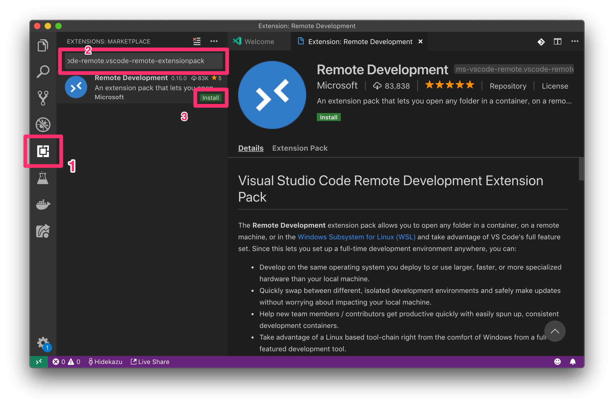
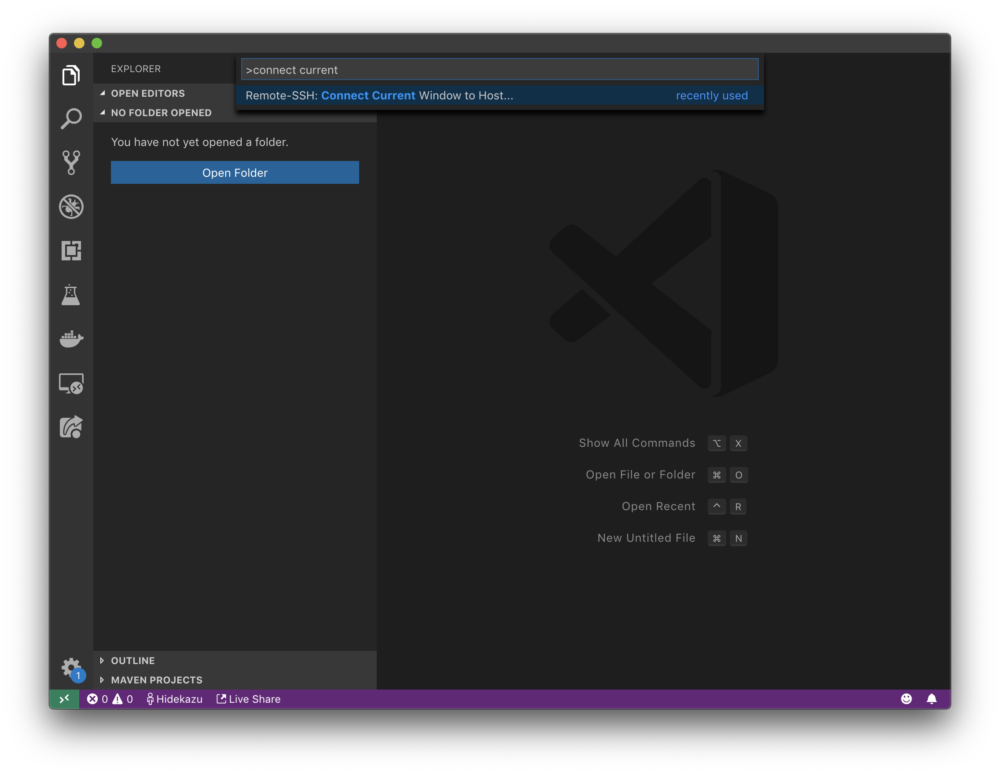
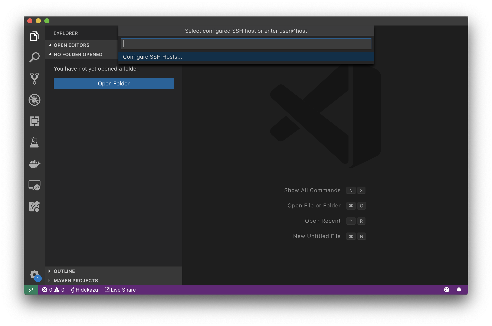
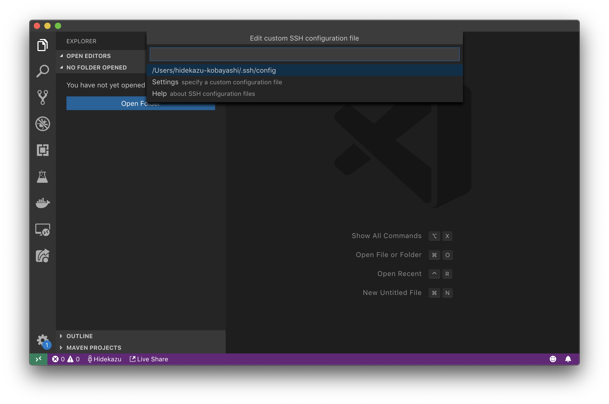
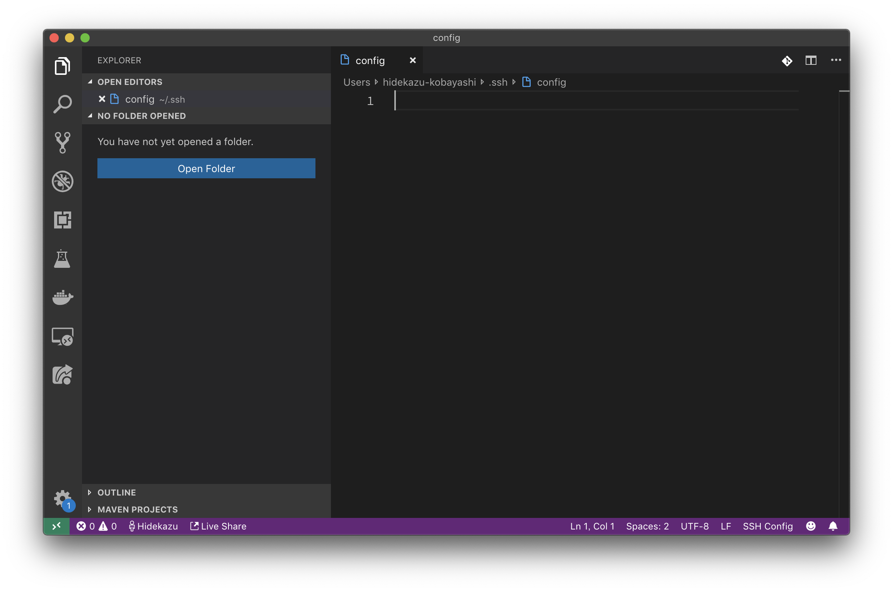
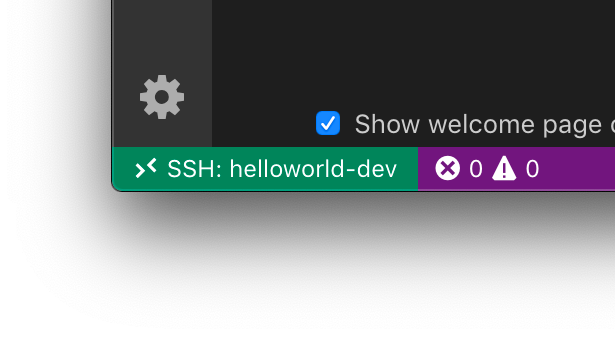
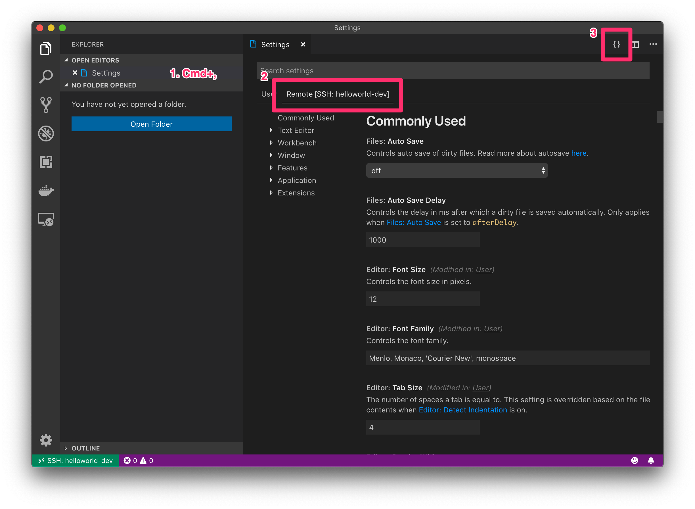
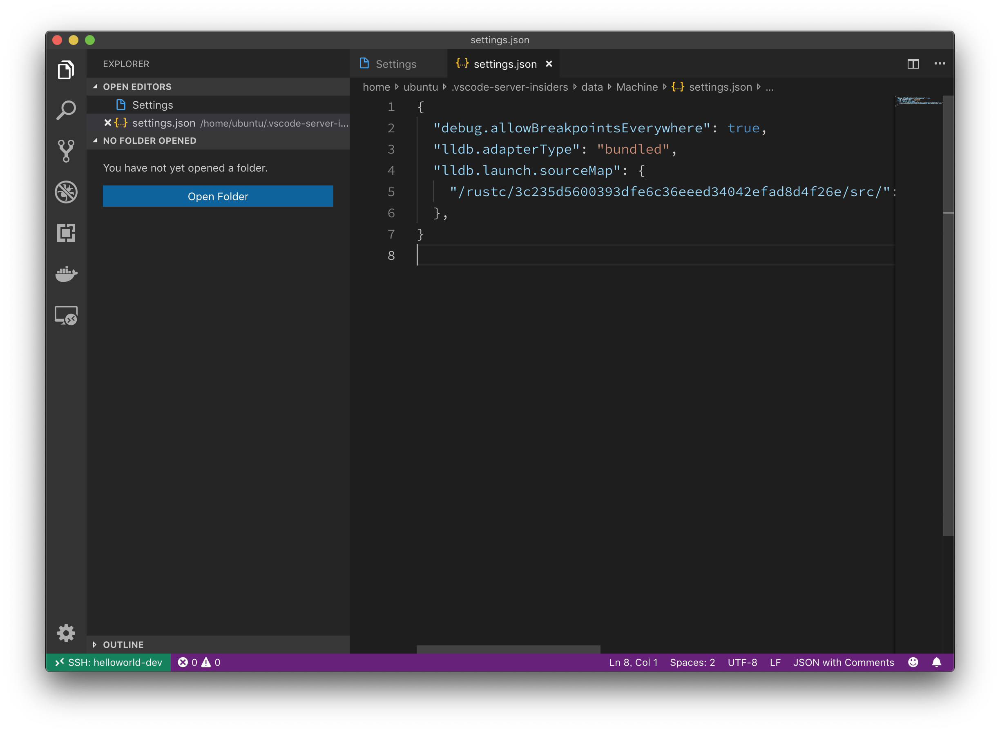
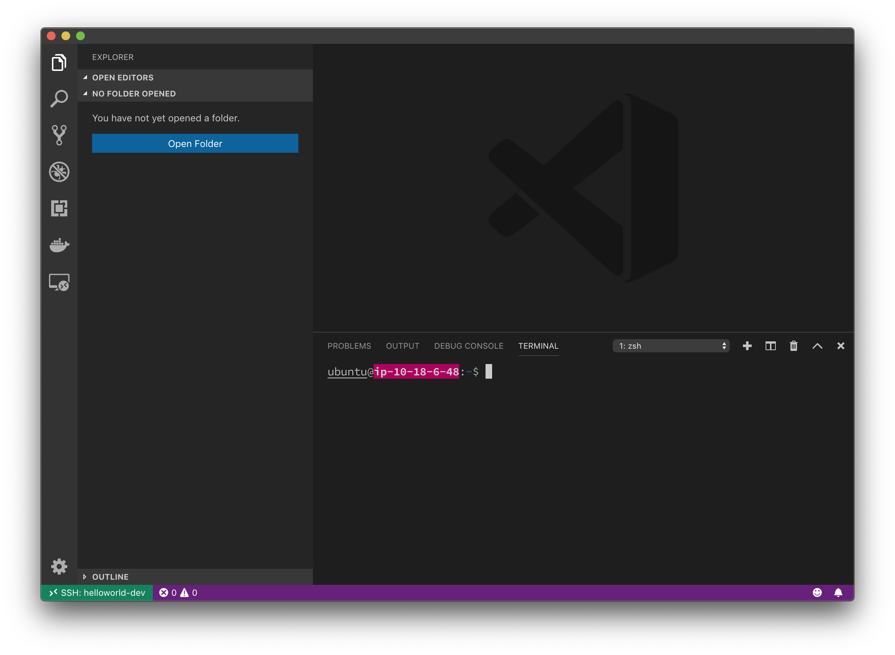

# 環境構築

## 2つの環境

### ローカル環境

本資料では、手元のコンピュータのことを「ローカル環境」と呼びます。
ローカル環境の OS はなんであっても構いませんが、後述の VS Code が動作する必要があります。

### 実験環境

ローカル環境とは別に、実際にコードを動かして観察するための環境を用意してください。この環境を、以下「実験環境」と呼びます。
実験環境は x86_64 アーキテクチャの CPU 上で動く Ubuntu Server 18.04 とし、ローカル環境から SSH で接続可能なようにしてください。
実験環境のメモリやディスクの容量は足りるように調整してください。メモリは2GB程度、ディスクは20GB程度あれば足りるでしょう。

## VS Code

本資料の全編を通し、実験環境のファイルを編集するために VS Code の Remote Development 機能を用います。

本資料の執筆時点では Remote Developmet は Insider 版の VS Code でしか利用できません。
下記から **ローカル環境に** VS Code Insider をダウンロードし、インストールしてください。
https://code.visualstudio.com/insiders/

インストールが完了したら、VS Code Insider を起動し、次の手順に進んでください。

### Remote Development

前述のとおり、Remote Development 機能を利用するため、当該の拡張機能をインストールします。

左のペインの拡張機能タブを開き、 `@id:ms-vscode-remote.vscode-remote-extensionpack` で検索してインストールします。



続いて、実験環境の接続情報を設定します。
Remote Development では、`~/.ssh/config` に書いたホストにしか接続できないため、それに実験環境のエントリを追加します。

まず VS Code でコマンドパレットを開きます(macOS では `Cmd-Shift-P`)。
そして、コマンドパレットに `connect current` と入力し、`Remote-SSH: Connect Current Window to Host...` にフォーカスが合っていることを確認して enter キーを押します。



するとパレットが遷移しますが、`Configure SSH Hosts...` にフォーカスを合わせたまま　enter キーを押します。



さらにパレットが遷移し、`.ssh/config` の場所を尋ねられますが、ここもそのまま enter キーを押して進みます。



`.ssh/config` が開いたら、接続情報を書いて保存します。



以下は `.ssh/config` の一例です。詳しくは OpenSSH のマニュアルを参照してください。

```
Host helloworld-dev
    HostName nanika-vm.example.com
    User yourname
```

設定が正しいか確認するため、試しに接続してみましょう。

コマンドパレットを開き `connect to host` で検索、`Connect to Host...` を実行します。
すると先程設定したホスト名が表示されるため、それを選択して実行してください。

画面が切り替わり、左下の緑色のリボンにホスト名が表示されていれば成功です。



以下の手順は接続が完了したウィンドウで行ってください。

### Rust(rls)

続いて、VS Code に拡張機能 Rust(rls) をインストールします。
Rust(rls) は　Rust を書くために便利な拡張機能です。

先ほどと同様に、左のペインから拡張機能タブを開き、`@id:rust-lang.rust ` を検索してインストールします。

### CodeLLDB

VS Code に拡張機能 CodeLLDB をインストールします。

拡張機能タブの検索窓で `@id:vadimcn.vscode-lldb` を検索してインストールします。

インストールが完了したら設定をします。
Settings を開き(macOS では `Cmd+,`)、`Remote` タブを選んだあと、右上の `{}` アイコンをクリックします。



すると、Settings の JSON エディタが開くので、以下の内容を貼り付けて保存します。

```json
{
  "debug.allowBreakpointsEverywhere": true,
  "lldb.adapterType": "bundled",
  "lldb.launch.sourceMap": {
    "/rustc/3c235d5600393dfe6c36eeed34042efad8d4f26e/src/": "${env:HOME}/.rustup/toolchains/stable-x86_64-unknown-linux-gnu/lib/rustlib/src/rust/src/",
  },
}
```



以上で VS Code のセットアップは完了です。

## Rust コンパイラ

ここから先は **実験環境** に SSH して作業します。

別途ターミナルエミュレータを立ち上げて SSH してもよいですが、先程セットアップした VS Code の Remote Development の機能を用いることもできます。

Remote Development の機能で実験環境のターミナルを開くには、実験環境に接続が完了しているウィンドウで Integrated Terminal を開きます(macOS では `Ctrl-Shift-~`)。



まずはじめに、Rust のコンパイラをインストールしましょう。

ターミナルで以下のコマンドを実行します。

```
curl https://sh.rustup.rs -sSf | sh
```

すると、途中で次のようなプロンプトが出るはずです。

```
Current installation options:

   default host triple: x86_64-unknown-linux-gnu
     default toolchain: stable
  modify PATH variable: yes

1) Proceed with installation (default)
2) Customize installation
3) Cancel installation
>
```

これはインストールの設定を変更するかどうか尋ねるものですが、デフォルト設定でインストールするため、何も入力せずに enter キーを押します。

以上で Rust のコンパイラのセットアップは完了です。

その他の各実験に必要なものは、資料の途中で随時インストール手順を示すので、それに従ってください。
