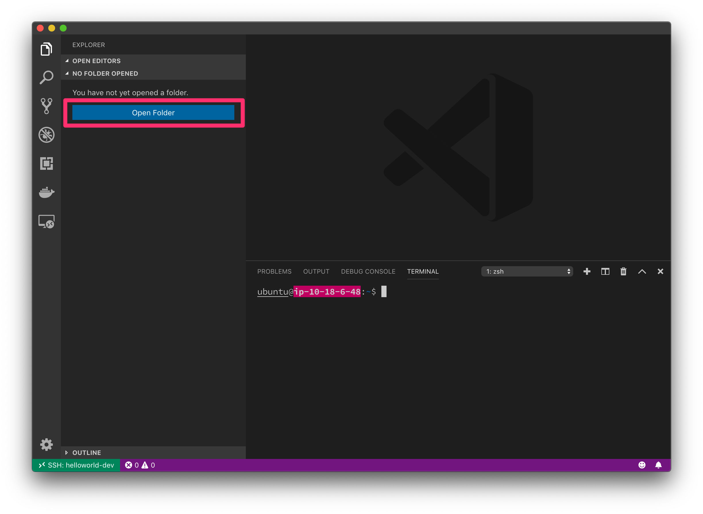
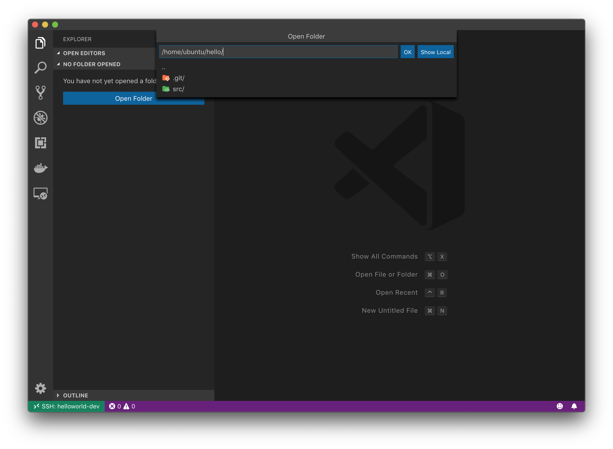
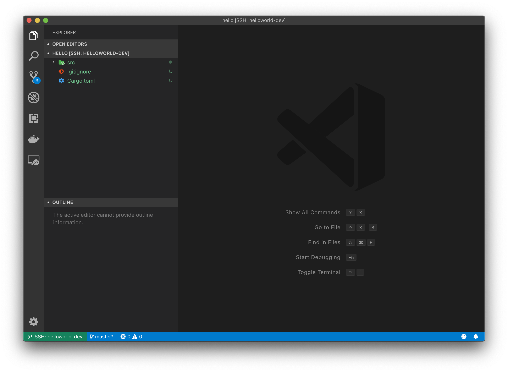
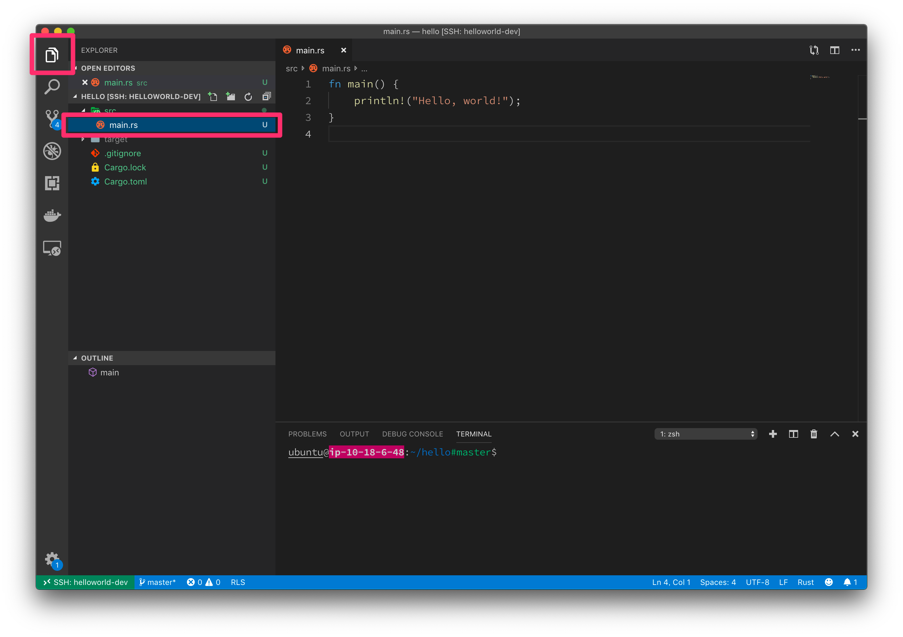

# とりあえず普通に Hello, world!

とにもかくにも、まずは普通に Hello, world! しましょう。

## ビルドのためのツールをインストールする

TBD

```
$ sudo apt update
$ sudo apt install build-essential
```

## パッケージをつくる

**開発環境** のターミナルを開き、次のコマンドを入力してください。各業の `#` より後ろの部分はコマンドの意味を示すコメントであり、入力する必要はありません。

```
$ mkdir hello # hello という名前のディレクトリを作成
$ cd hello # hello ディレクトリに移動
```

`hello` ディレクトリがどこにあるのか確認しておきましょう。

コマンド:
```
$ pwd # 現在のディレクトリを表示
```

出力:
```
/home/ubuntu/hello
```

出力はあなたのユーザー名によって違うでしょう。いずれにしても、きっとホームディレクトリの中に作成されているはずです。

次に、この時点では `hello` ディレクトリにはなにもないことを確認しましょう。

コマンド:
```
$ ls
```

なにも表示されないはずです。

このまっさらなディレクトリに Rust のパッケージを作成するには次のコマンドを実行します。これは整地作業のようなものです。

```
$ cargo init # 現在のディレクトリ(つまり hello)に Rust のパッケージを作成
```

すると以下のような表示が出ます。

```
Created binary (application) package
```

整地作業によってどんなファイルができているか確認しましょう。

コマンド:
```
$ ls
```

出力:
```
Cargo.toml  src
```

コマンド:
```
$ ls src
```

出力:
```
main.rs
```

いくつかのファイルとディレクトリができていることが確認できました。

ファイルの中身を見るのは VS Code でパッケージディレクトリを開いてからにしましょう。

## VS Code で開く

開発環境に接続済みのウィンドウを開いてください。

次に、左のペインからエクスプローラタブを開き、`Open Folder` をクリックします。



ディレクトリのパスを尋ねるプロンプトが開くはずです。はじめに `pwd` コマンドで確認したパスを入力し、末尾に `/` を追加してから `OK` をクリックします。



左のペインに先程 `ls` で確認したのと同様のファイルが見えていれば完了です。



## main.rs を読む

先程実行した `ls` で `src/` ディレクトリ以下に `main.rs` というファイルがあることがわかっています。

`.rs` というのは Rust 言語で書かれたソースコードの拡張子です。

Rust のパッケージでは、まず `src/main.rs` からプログラムを始めることになっています。

ではこの `src/main.rs` を開いてみましょう。

左のペインからエクスプローラタブを開き、`src` ディレクトリ以下にある `main.rs` を選択します。



なんということでしょう。もう Hello, world! のコードが書かれているではありませんか。

Rust では `cargo init` するだけで Hello, world! が完成しているのです。

Hello, world! をするのが目的にもかかわらず、1行もコードを書かないうちにそれが完成していることに驚く気持ちはわかりますが、落ち着いてソースコードを丁寧に観察していきましょう。

```rust
fn main() {
    println!("Hello, world!");
}
```

まず1行目の `fn main() {` では `main` 関数を定義していることがわかります。

Rust でもC言語と同じく、プログラムは `main` という名前の関数から始まります。

二行目の `println!("Hello, world!");` は、どうやら Hello, world! を出力する命令のように見えます。

さて `println!` というのはどういう構文でしょうか。関数名の最後に感嘆符が付いているように見えます。

実は Rust では、マクロ呼出しのときにマクロ名の末尾に感嘆符を付けます。これは関数呼び出しとマクロ呼出しを区別するためです。

つまり、この `println!` は `println` というマクロを呼び出しているのです。

マクロについてはここでは詳しく触れません。次のチャプターで詳しく見ていくことにします。

`"Hello, world!"` については解説は不要でしょう。文字列リテラルです。

そして、最後の `}` は `main` 関数を閉じているだけです。よいですね?

## Hello, world! する

ソースコードも確認したところで、実際にプログラムを実行してみましょう。

実行するには **開発環境** のターミナルを開き、パッケージのディレクトリの中で次のコマンドを実行します。

```
$ cargo run
```

出力:
```
   Compiling hello v0.1.0 (/home/ubuntu/hello)
    Finished dev [unoptimized + debuginfo] target(s) in 0.33s
     Running `target/debug/hello`
Hello, world!
```

Congrats! 🎉

無事に Hello, world! ができました。Rust ってなんて簡単なんでしょう。

## まとめ

- Rust ではパッケージを作るだけで Hello, world! が完成している
- `cargo run` で実行できる
- Rust は簡単
