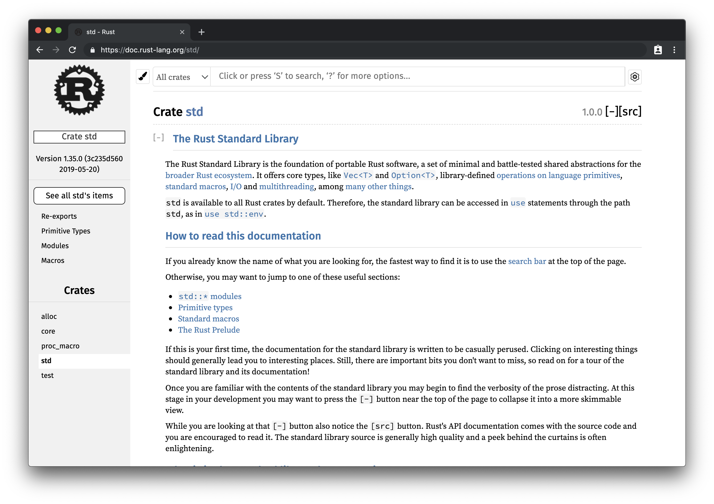
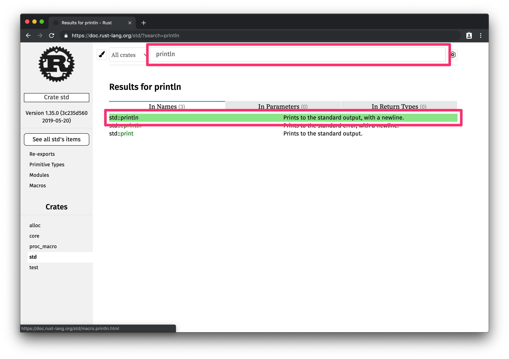
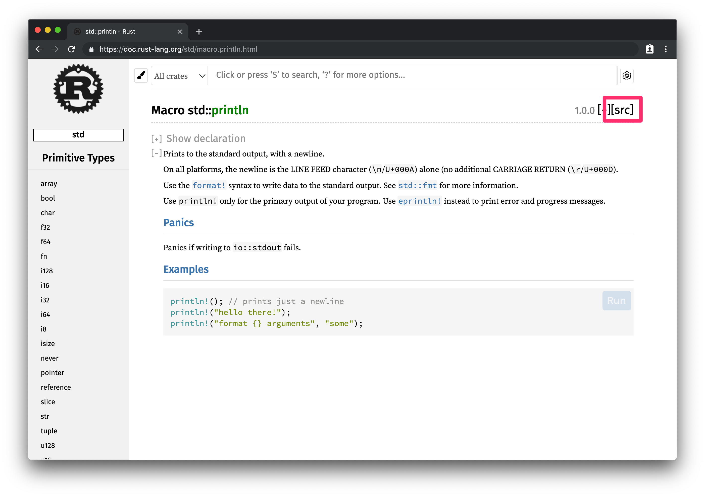
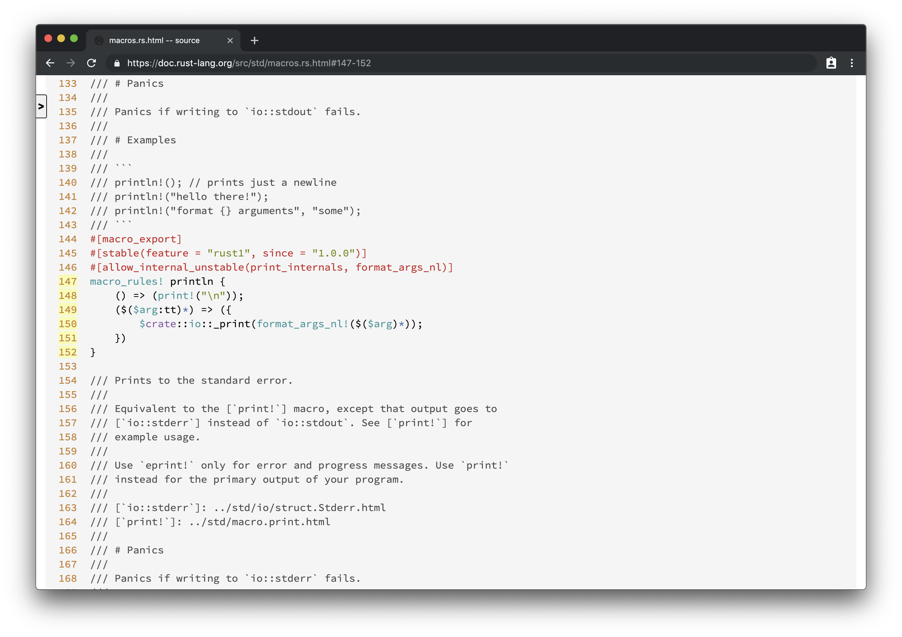

# マクロは真っ黒

## 事前準備

このチャプターでは `cargo-expand` というツールを使います。次の手順に進む前に、とりあえず先にこのコマンドを実行しましょう。
そうすればきっといいことがありますよ。

```
rustup toolchain install nightly && cargo install cargo-expand
```

※コマンドの終了を待たずに、次を読み進めてよい

## 定義を探して

さて、先程見て見ぬふりをしたマクロに正面から向き合うことにしましょう。

マクロとはつまり、コードを書き換えるルールのことです。

マクロの呼び出しはそのルールに従って *展開* されます。つまり、コードが書き換わるのです。

マクロはメタプログラミングの一種で、実行時に作用する関数呼び出しとは異なり、*コンパイル時* に作用します。

マクロはコンパイル時に作用するコードの書き換えルールなのだとすれば、先程の `println!` にもそのルールの定義がどこかにあり、また書き換えられたあとの真の姿があるはずです。

そうと決まれば、それを探しに行きましょう。

探すアテはあるのか? あります。公式のドキュメンテーションはあなたの味方です。Rust で迷子になったときはいつでも頼もしい地図となるでしょう。

外部のライブラリを一切導入した記憶はない(そもそもパッケージを作成しただけである)とするならば、`println!` の定義は標準ライブラリにあるのだろうと見当が付くでしょう。

その予想は当たっており、`println!` について調べるには標準ライブラリのドキュメンテーションを開くのが正解です。

[std - Rust](https://doc.rust-lang.org/std/)

せっかくなので標準ライブラリのドキュメンテーションの使い方を練習してみましょう。

まず上記リンクをウェブブラウザで開くと以下のようなページが表示されます。



この上部にある検索窓に、今探したいマクロの名前である `println` を入力します。



するとインクリメンタルサーチが行われ、下に検索結果が表示されます。

`std::println` がお目当てのマクロですので、これを開きます。



使い方の例などが表示されましたが、今知りたいのは具体的な定義ですので、右上の
　`[src]` リンクをクリックして、ソースコードにジャンプします。



定義にたどり着けました。

```
macro_rules! println {
    () => (print!("\n"));
    ($($arg:tt)*) => ({
        $crate::io::_print(format_args_nl!($($arg)*));
    })
}
```

雰囲気で察するに、`std::io::_print` という関数の呼び出しに書き換える、というルールのようです。

しかしまだ問題があります。マクロの定義の中にマクロ呼び出しがあります。`format_args_nl!` とはなんでしょうか。

次は `format_args_nl!` の定義を追いますか?

ちょっと待ってください。マクロの定義は再帰的なため、マトリョーシカ人形のように中から次々にマクロ呼出しが出てくる可能性があります。

このような反復的な作業は人間がやるべきではありません。コンピュータにやらせるべきです。

もっとも、このケースでは雰囲気で Rust のコードを読み進めている我々よりも、コンパイラの方がよっぽど Rust のマクロ展開について詳しいのは明白ですから、人間がやる理由はほとんどありません。

## 真の姿

ときに人間、このセクションの冒頭に書いてあったコマンドは実行しましたか?　そしてその実行は完了していますか?

`cargo-expand` を用いると、マクロをすべて展開した後の *真の姿* を簡単に調べることができます。

(インストールコマンドの実行がまだ完了していない場合はそれを待ってから、)実行してみましょう。

コマンド:
```
$ cargo expand
```

出力:
```
    Checking hello v0.1.0 (/home/ubuntu/hello)
    Finished dev [unoptimized + debuginfo] target(s) in 0.06s

#![feature(prelude_import)]
#![no_std]
#[prelude_import]
use ::std::prelude::v1::*;
#[macro_use]
extern crate std as std;
fn main() {
    {
        ::std::io::_print(::std::fmt::Arguments::new_v1(&["Hello, world!\n"],
                                                        &match () {
                                                             () => [],
                                                         }));
    };
}
```

ジャジャーン。

真の姿を見せました。`fn main() {` より上に書いてある呪文は無視しましょう。ここで真面目に取り合ってもロクなことにならないからです。

大切なのは `main` 関数の中です。`println!` マクロ呼出しは `::std::io::_print` や `::std::fmt::Arguments::new_v1` といった関数の呼び出しに書き換えられるようです。

このように、マクロの定義を追うのは一苦労です。マクロには、普通の関数にはない特別なパワーがありますが、その例外的な強力さ故にわかりづらくなってしまいます。

そのため、抽象化のためにマクロを用いるのは最終手段にするのがよいでしょう。諸刃の剣ともなりうる切り札は最後までとっておくものです。

## まとめ

- マクロの定義を追うのは面倒
- `cargo-expand` を使うと真の姿を簡単に暴ける
- マクロは最終手段の黒魔術
