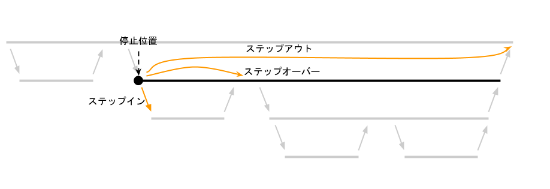

# むしとりしょうねん

このチャプターに麦わら帽子は要りません。必要なのはデバッガです。

実は、デバッガは環境構築のチャプターで既にインストール済みです。

ただし、デバッガを起動するための設定が足りません。

## デバッガの設定

まず左のペインで、いかにも虫が取れそうなアイコンのデバッグタブを開き、続いてデバッグの設定アイコンをクリックします。


すると、デバッガのタイプを選択するダイアログが開くため、`LLDB` を選択します。


気を利かせて、設定を自動生成するかどうか尋ねるダイアログ開きます。ご厚意に甘えて `Yes` をクリックします。


デバッガの起動設定が生成されました。

正しく生成されない場合は以下の内容を `.vscode/launch.json` に貼り付けてください。

```
{
  // Use IntelliSense to learn about possible attributes.
  // Hover to view descriptions of existing attributes.
  // For more information, visit: https://go.microsoft.com/fwlink/?linkid=830387
  "version": "0.2.0",
  "configurations": [
    {
      "type": "lldb",
      "request": "launch",
      "name": "Debug executable 'hello'",
      "cargo": {
        "args": [
          "build",
          "--bin=hello",
          "--package=hello"
        ],
        "filter": {
          "name": "hello",
          "kind": "bin"
        }
      },
      "args": [],
      "cwd": "${workspaceFolder}"
    },
    {
      "type": "lldb",
      "request": "launch",
      "name": "Debug unit tests in executable 'hello'",
      "cargo": {
        "args": [
          "test",
          "--no-run",
          "--bin=hello",
          "--package=hello"
        ],
        "filter": {
          "name": "hello",
          "kind": "bin"
        }
      },
      "args": [],
      "cwd": "${workspaceFolder}"
    }
  ]
}
```


起動設定のタブを閉じ、`main.rs` のタブに戻ります。そして、左ペインの実行ボタンをクリックします。


すると、プログラムが実行され、下のペインに出力が表示されます。


デバッガによる出力が混ざっていますが、たしかに "Hello, world!" が出力されています。

## ブレークポイント

デバッガの最大の特徴は、プログラムの実行を途中で一時停止できることです。

プログラムの実行を一時停止するには、一時停止したい行にブレークポイントを貼ります。

ブレークポイントを貼るには、行番号の左側の部分をクリックします。


そして、先ほどと同様に実行ボタンをクリックします。

すると、プログラムはブレークポイントが貼られた行の直前で一時停止します。
(つまり、停止したときにはその行はまだ実行されていない)


この場合、`println!` の行はまだ実行されていないため、下のペインの出力には　`Hello, world!` の文字はありません。

ここで、実行を再開するには、左のペインの実行ボタンではなく、画面上部に浮いているツールバーの青い再開ボタンをクリックします。


実行が再開し、完了します。そしてまた、下のペインに　`Hello, world!` が出力されているのが確認できます。


ブレークポイントは複数貼ることもできます。その場合は実行を再開する度に、次のブレークポイントで停止します。

## ステップオーバー・ステップイン・ステップアウト

ブレークポイント等で停止したところからそのまま実行を再開するのではなく、細かな単位で少しずつ実行を進めることができます。

細かく実行を進める機能には3つの種類がありますが、それぞれの動きについては言葉で説明するより図で説明するほうがわかりやすいでしょう。



チャプター3で練習したみなさんなら即座に理解できるでしょう。

## まとめ

- デバッガを使うとプログラムの実行を途中で止められる
- ブレークポイントを貼ることで一時停止場所を設定できる
- ステップオーバー・ステップイン・ステップアウトで少しずつ実行できる
