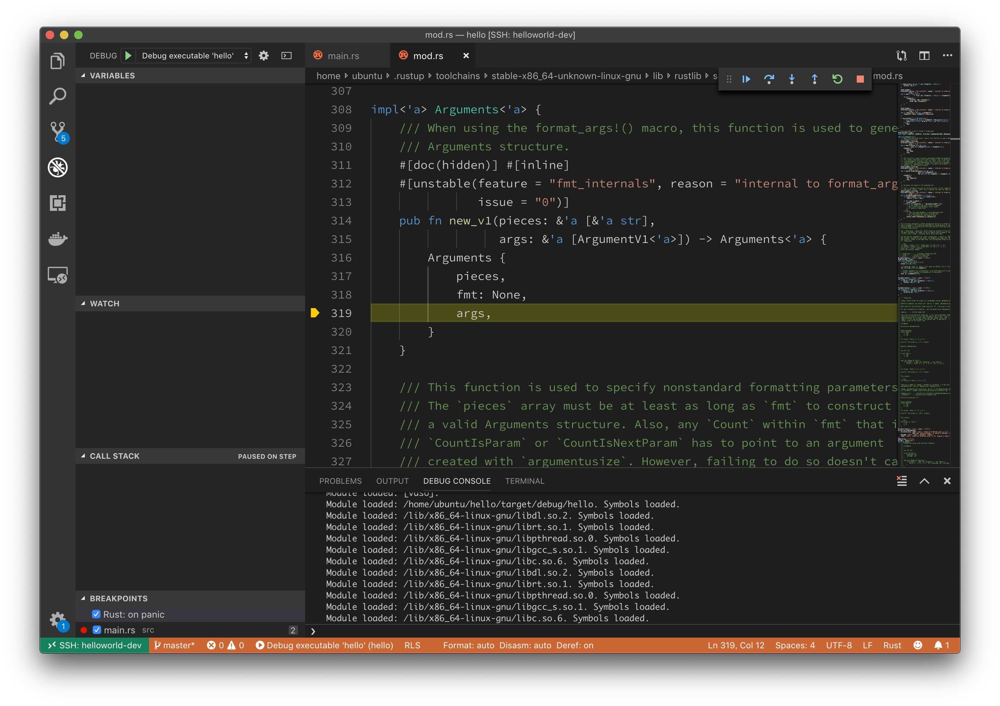

# 一歩ずつ

## 捜査は足で

前のチャプターで、デバッガを使えばプログラムを少しずつ実行できるということを学びました。

とくに、ステップインを使えば、とにかくすべての処理を1つずつ飛ばさずに実行できるということがわかりました。

つまり、ステップインですべての処理を1つずつ実行しながら、その前後で出力に変化があるかどうかを確認すれば、真犯人を見つけることができそうですね!

まずはブレークポイントを貼ります。


そしてステップイン。


まだ変化なし。

ステップイン。


まだ変化なし。

ステップイン。



まだ変化なし。

ステップイン。


まだ変化なし。

ステップイン。


まだ変化なし。

ステップイン。


まだ変化なし。

ステップイン。


まだ変化なし。

ステップイン。


まだ変化なし。

ステップイン。


まだ変化なし。

ステップイン。


まだ変化なし。

ステップイン。


まだ変化なし。


ステップイン。


まだ変化なし。


ステップイン。


まだ変化なし。

……

果たしてこの作業はいつ終わるのでしょうか。

わたしたちは一体何ステップ実行すれば真犯人にたどり着けるのでしょうか。

以前にも一度、似たようなことを言ったような気がしますが、こういう作業は人間がやるべきではありません。

「退屈なことはPythonにやらせよう」というやつです。

## 退屈なことはPythonにやらせよう

今使っているこのデバッガの正体は LLDB というものです。

今までポチポチしてきた VS Code の画面は本当にただの画面にすぎず、デバッガの実体である LLDB を間接的に操作しているだけです。

さてこの LLDB、実は他にも操作する方法があります。それは Python による方法です。

なんと、Python によってデバッガの操作ができるため、先程のような退屈な操作を自動化することができます。

ここで、さぁ Python でスクリプトを書いてみましょう、というのはあまりに難易度が高すぎるため、筆者の書いたスクリプトを貼っておきます。

```
import lldb

exe = "target/debug/hello"

dbg = lldb.SBDebugger.Create()
dbg.SetAsync(False)

dbg.HandleCommand("settings set target.source-map /rustc/3c235d5600393dfe6c36eeed34042efad8d4f26e/src/ /home/ubuntu/.rustup/toolchains/stable-x86_64-unknown-linux-gnu/lib/rustlib/src/rust/src/")
dbg.HandleCommand('settings set frame-format frame "frame #${frame.index}: ${frame.pc}{ ${module.file.basename}{`${function.name-with-args}{${frame.no-debug}${function.pc-offset}}}}{ at ${line.file.fullpath}:${line.number}}{${function.is-optimized} [opt]}\n"')

target = dbg.CreateTarget(exe)
launch_info = lldb.SBLaunchInfo([exe])
breakpoint = target.BreakpointCreateBySourceRegex(
    'Hello, world!', lldb.SBFileSpec("main.rs"))
error = lldb.SBError()
process = target.Launch(launch_info, error)

dbg.HandleCommand("f")

thread = process.GetThreadAtIndex(0)
out = ""
while len(out) == 0 and process.GetState() != lldb.eStateExited:
    thread.StepInto()
    out = process.GetSTDOUT(1024)

dbg.HandleCommand("bt")
dbg.HandleCommand("f")
```

このスクリプトを実行するためには少々面倒な環境設定が必要なため、ここでは実行結果を示すに留めることとします。

自分で実行してみたい人は、あとできっと用意されるであろう付録を参照してください。

```
frame "frame #0: 0x0000555555557cd7 hello`hello::main::h796ecd7574dcc3b0 at /home/ubuntu/hello/src/main.rs:2
"   1   	fn main() {
-> 2   	    println!("Hello, world!");
   3   	}
* thread #1, name = 'hello', stop reason = step in
  * frame "frame #0: 0x000055555555af1c hello`flush_buf<std::io::stdio::Maybe<std::io::stdio::StdoutRaw>> [inlined] write at /home/ubuntu/.rustup/toolchains/stable-x86_64-unknown-linux-gnu/lib/rustlib/src/rust/src/./libstd/sys/unix/fd.rs:110
"    frame "frame #1: 0x000055555555af07 hello`flush_buf<std::io::stdio::Maybe<std::io::stdio::StdoutRaw>> [inlined] write at /home/ubuntu/.rustup/toolchains/stable-x86_64-unknown-linux-gnu/lib/rustlib/src/rust/src/./libstd/sys/unix/stdio.rs:28
"    frame "frame #2: 0x000055555555af07 hello`flush_buf<std::io::stdio::Maybe<std::io::stdio::StdoutRaw>> [inlined] write at /home/ubuntu/.rustup/toolchains/stable-x86_64-unknown-linux-gnu/lib/rustlib/src/rust/src/./libstd/io/stdio.rs:84
"    frame "frame #3: 0x000055555555af07 hello`flush_buf<std::io::stdio::Maybe<std::io::stdio::StdoutRaw>> [inlined] write<std::io::stdio::StdoutRaw> at /home/ubuntu/.rustup/toolchains/stable-x86_64-unknown-linux-gnu/lib/rustlib/src/rust/src/./libstd/io/stdio.rs:100
"    frame "frame #4: 0x000055555555af07 hello`flush_buf<std::io::stdio::Maybe<std::io::stdio::StdoutRaw>> at /home/ubuntu/.rustup/toolchains/stable-x86_64-unknown-linux-gnu/lib/rustlib/src/rust/src/./libstd/io/buffered.rs:494
"    frame "frame #5: 0x000055555555bcb1 hello`write [inlined] flush<std::io::stdio::Maybe<std::io::stdio::StdoutRaw>> at /home/ubuntu/.rustup/toolchains/stable-x86_64-unknown-linux-gnu/lib/rustlib/src/rust/src/./libstd/io/buffered.rs:628
"    frame "frame #6: 0x000055555555bca9 hello`write [inlined] flush<std::io::stdio::Maybe<std::io::stdio::StdoutRaw>> at /home/ubuntu/.rustup/toolchains/stable-x86_64-unknown-linux-gnu/lib/rustlib/src/rust/src/./libstd/io/buffered.rs:976
"    frame "frame #7: 0x000055555555bca9 hello`write [inlined] write<std::io::stdio::Maybe<std::io::stdio::StdoutRaw>> at /home/ubuntu/.rustup/toolchains/stable-x86_64-unknown-linux-gnu/lib/rustlib/src/rust/src/./libstd/io/buffered.rs:960
"    frame "frame #8: 0x000055555555bc98 hello`write at /home/ubuntu/.rustup/toolchains/stable-x86_64-unknown-linux-gnu/lib/rustlib/src/rust/src/./libstd/io/stdio.rs:499
"    frame "frame #9: 0x000055555555c49f hello`write_all<std::io::stdio::StdoutLock> at /home/ubuntu/.rustup/toolchains/stable-x86_64-unknown-linux-gnu/lib/rustlib/src/rust/src/./libstd/io/mod.rs:1208
"    frame "frame #10: 0x000055555555cabb hello`write_str<std::io::stdio::StdoutLock> at /home/ubuntu/.rustup/toolchains/stable-x86_64-unknown-linux-gnu/lib/rustlib/src/rust/src/./libstd/io/mod.rs:1268
"    frame "frame #11: 0x00005555555741fb hello`write at /home/ubuntu/.rustup/toolchains/stable-x86_64-unknown-linux-gnu/lib/rustlib/src/rust/src/./libcore/fmt/mod.rs:1033
"    frame "frame #12: 0x000055555555b961 hello`write_fmt [inlined] write_fmt<std::io::stdio::StdoutLock> at /home/ubuntu/.rustup/toolchains/stable-x86_64-unknown-linux-gnu/lib/rustlib/src/rust/src/./libstd/io/mod.rs:1279
"    frame "frame #13: 0x000055555555b920 hello`write_fmt at /home/ubuntu/.rustup/toolchains/stable-x86_64-unknown-linux-gnu/lib/rustlib/src/rust/src/./libstd/io/stdio.rs:493
"    frame "frame #14: 0x000055555555c099 hello`_print [inlined] {{closure}}<std::io::stdio::Stdout> at /home/ubuntu/.rustup/toolchains/stable-x86_64-unknown-linux-gnu/lib/rustlib/src/rust/src/./libstd/io/stdio.rs:737
"    frame "frame #15: 0x000055555555c045 hello`_print [inlined] try_with<core::cell::RefCell<core::option::Option<alloc::boxed::Box<Write>>>,closure,core::result::Result<(), std::io::error::Error>> at /home/ubuntu/.rustup/toolchains/stable-x86_64-unknown-linux-gnu/lib/rustlib/src/rust/src/./libstd/thread/local.rs:299
"    frame "frame #16: 0x000055555555bf5c hello`_print [inlined] print_to<std::io::stdio::Stdout> at /home/ubuntu/.rustup/toolchains/stable-x86_64-unknown-linux-gnu/lib/rustlib/src/rust/src/./libstd/io/stdio.rs:731
"    frame "frame #17: 0x000055555555bf5c hello`_print at /home/ubuntu/.rustup/toolchains/stable-x86_64-unknown-linux-gnu/lib/rustlib/src/rust/src/./libstd/io/stdio.rs:753
"    frame "frame #18: 0x0000555555557cf4 hello`hello::main::h796ecd7574dcc3b0 at /home/ubuntu/hello/src/main.rs:2
"    frame "frame #19: 0x0000555555557e30 hello`std::rt::lang_start::_$u7b$$u7b$closure$u7d$$u7d$::h9ff2a3ce32f1f5df at /home/ubuntu/.rustup/toolchains/stable-x86_64-unknown-linux-gnu/lib/rustlib/src/rust/src/./libstd/rt.rs:64
"    frame "frame #20: 0x0000555555561d33 hello`do_call<closure,i32> [inlined] {{closure}} at /home/ubuntu/.rustup/toolchains/stable-x86_64-unknown-linux-gnu/lib/rustlib/src/rust/src/./libstd/rt.rs:49
"    frame "frame #21: 0x0000555555561d27 hello`do_call<closure,i32> at /home/ubuntu/.rustup/toolchains/stable-x86_64-unknown-linux-gnu/lib/rustlib/src/rust/src/./libstd/panicking.rs:293
"    frame "frame #22: 0x00005555555638ca hello`__rust_maybe_catch_panic at /home/ubuntu/.rustup/toolchains/stable-x86_64-unknown-linux-gnu/lib/rustlib/src/rust/src/./libpanic_unwind/lib.rs:87
"    frame "frame #23: 0x00005555555627ed hello`lang_start_internal [inlined] try<i32,closure> at /home/ubuntu/.rustup/toolchains/stable-x86_64-unknown-linux-gnu/lib/rustlib/src/rust/src/./libstd/panicking.rs:272
"    frame "frame #24: 0x00005555555627af hello`lang_start_internal [inlined] catch_unwind<closure,i32> at /home/ubuntu/.rustup/toolchains/stable-x86_64-unknown-linux-gnu/lib/rustlib/src/rust/src/./libstd/panic.rs:388
"    frame "frame #25: 0x00005555555627af hello`lang_start_internal at /home/ubuntu/.rustup/toolchains/stable-x86_64-unknown-linux-gnu/lib/rustlib/src/rust/src/./libstd/rt.rs:48
"    frame "frame #26: 0x0000555555557e09 hello`std::rt::lang_start::h869673eb9744a958(main=(hello`hello::main::h796ecd7574dcc3b0 at main.rs:1), argc=2, argv=0x00007fffffffee18) at /home/ubuntu/.rustup/toolchains/stable-x86_64-unknown-linux-gnu/lib/rustlib/src/rust/src/./libstd/rt.rs:64
"    frame "frame #27: 0x0000555555557d2a hello`main + 42
"    frame "frame #28: 0x00007ffff71c2b97 libc.so.6`__libc_start_main(main=(hello`main), argc=2, argv=0x00007fffffffee18, init=<unavailable>, fini=<unavailable>, rtld_fini=<unavailable>, stack_end=0x00007fffffffee08) at /build/glibc-OTsEL5/glibc-2.27/csu/../csu/libc-start.c:310
"    frame "frame #29: 0x0000555555557bca hello`_start + 42
"frame "frame #0: 0x000055555555af1c hello`flush_buf<std::io::stdio::Maybe<std::io::stdio::StdoutRaw>> [inlined] write at /home/ubuntu/.rustup/toolchains/stable-x86_64-unknown-linux-gnu/lib/rustlib/src/rust/src/./libstd/sys/unix/fd.rs:110
"   107 	    }
   108
   109 	    pub fn write(&self, buf: &[u8]) -> io::Result<usize> {
-> 110 	        let ret = cvt(unsafe {
   111 	            libc::write(self.fd,
   112 	                        buf.as_ptr() as *const c_void,
   113 	                        cmp::min(buf.len(), max_len()))
```

ちなみに、ここまで到達するには456ステップが必要だったようです。Python にやらせて正解でしたね。
